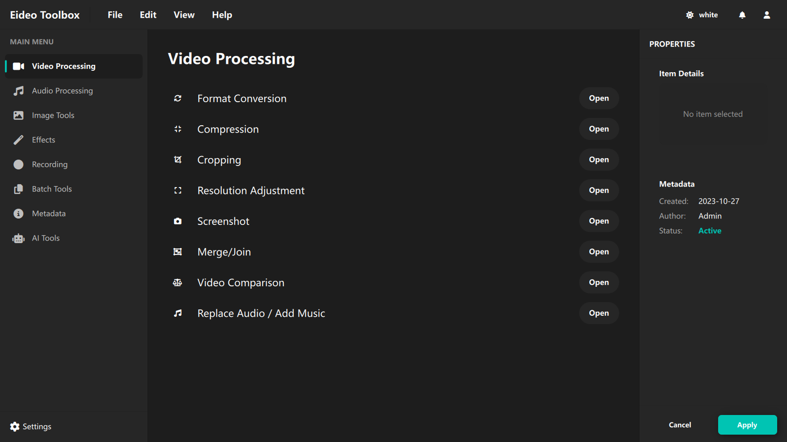
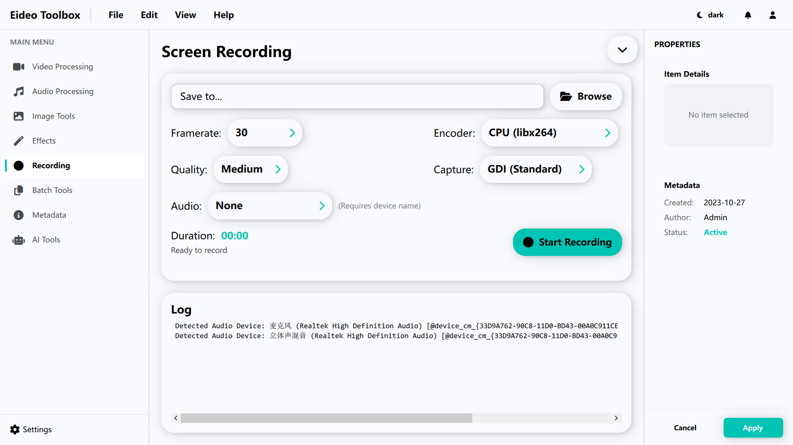

# 🎥✨ Eideo — 跨平台音视频全能工具

🚀 一个由 Qt 驱动的现代音视频处理软件，支持 **Windows / macOS / Linux**，集成了 **录制、推流、剪辑、压缩、滤镜、GIF 制作等**强大功能于一体，让你轻松玩转多媒体处理！

 <!-- 可放截图 -->

---

## 🧩 功能概览

| 功能模块         | 描述                                                                 |
|------------------|----------------------------------------------------------------------|
| 📼 屏幕/摄像头录制 | 高性能 FFmpeg 内核，支持自定义分辨率、帧率、编码格式                           |
| 📡 实时推流        | 支持 RTMP / SRT 推流，快速发布到 YouTube、Bilibili、抖音直播平台                |
| ✂️ 剪辑工具        | 精确到帧的音视频剪切，支持裁剪、合并、多轨道拼接                                |
| 💠 AI 放大         | 接入 Real-ESRGAN / Waifu2x，实现视频无损超分辨率放大                             |
| 🌀 滤镜美化        | 支持模糊、高斯、反色、黑白、锐化等常见滤镜，实时预览                             |
| 🔄 格式转码        | 支持几乎所有格式：MP4 / MKV / MOV / FLV / GIF / WEBM / AVI / MP3 / AAC 等       |
| 🗜️ 智能压缩        | 指定目标大小/码率自动压缩，极致瘦身不失真                                       |
| 🖼️ GIF 制作        | 任意视频一键转 GIF，支持帧率调整、循环控制                                       |
| 🌈 主题切换        | 支持深色/浅色模式，未来拟加入毛玻璃 UI 效果                                      |

---

## 💻 截图预览

| 录制界面 🎥 | 推流设置 📡 | 剪辑编辑 ✂️ |
|------------|-------------|-------------|
|  |  |  |

---

## ⚙️ 技术架构

- 📦 使用 Qt 6.9 + QML 打造现代化 UI
- 🔧 后端基于 FFmpeg，支持命令调用与 API 控制
- 🧵 多线程异步任务处理，不卡主界面
- 🧬 可扩展插件系统（未来版本）

---

## 📦 安装方式（开发中）

> 当前为预览版，支持以下启动方式：

```bash
git clone https://github.com/sudoevolve/Eideo.git
cd Eideo
mkdir build && cd build
cmake ..
make
./Eideo
